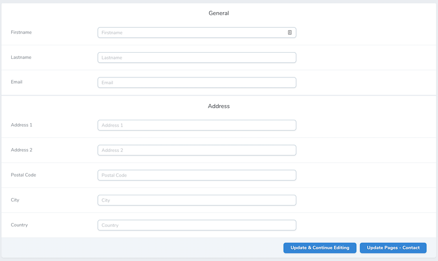

# Nova Header Field

Simple field to add a header to separate panels in the form.



## Installation

You can install the package in to a Laravel app that uses [Nova](https://nova.laravel.com) via composer:

```bash
composer require ngiraud/nova-header-field
```

## Usage

Add the field to your Nova resource `fields` method :

```php
public function fields(Request $request)
    {
        return [
            (new Panel(__('General'), [

                FormHeader::make(__('General')),

                Text::make(__('Firstname'), 'firstname'),
                Text::make(__('Lastname'), 'lastname'),
                Text::make(__('Email'), 'email'),
                ...
            ]))->withToolbar(),

            new Panel(__('Address'), [

                FormHeader::make(__('Address')),

                Text::make(__('Address 1'), 'address_1'),
                Text::make(__('Address 2'), 'address_2'),
                Text::make(__('Postal Code'), 'postal_code'),
                Text::make(__('City'), 'city'),
                Text::make(__('Country'), 'country'),
                ...
            ]),
        ];
    }
```

## Changelog

Please see [CHANGELOG](CHANGELOG.md) for more information on what has changed recently.

## Security

If you discover any security related issues, please email contact@ngiraud.me instead of using the issue tracker.

## Credits

- [Nicolas Giraud](https://github.com/ngiraud)

## License

The MIT License (MIT). Please see [License File](LICENSE.md) for more information.